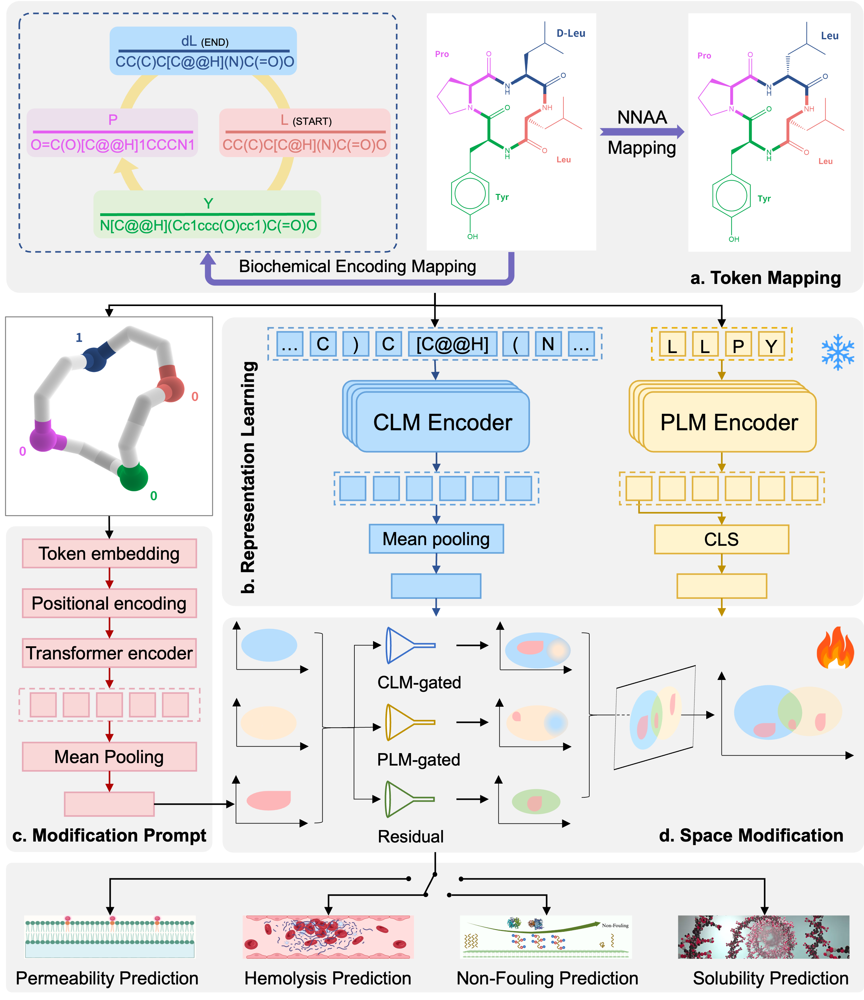

# Bi-TEAM

Bi-TEAM is the first unified framework exploring cross-scale biochemical space to predict the properties of NNAA-containing peptides 

## Overview
Bi-TEAM begins by mapping each NNAA to its closest natural amino acid, preserving critical evolutionary and structural cues in standard PLM tokens. A bi-gated network preserves each domain’s primary representational role while adaptively integrating signals from the other domain. A residual fusion layer then retrieves and synthesizes these interdependent signals, revealing how local chemical perturbations drive changes in macroscopic peptide function. Additionally, a “modification location prompt” pinpoints the exact site of substitution, guiding a specialized CLM to capture the fine-grained chemical variation introduced by each NNAA.



## Getting Started

### Prerequisites

- Python 3.10
- Required Python packages (see Installation section)

### Installation

1. Clone the repository:
```bash
git clone https://github.com/zjgao02/Bi-TEAM.git
cd Bi-TEAM
```

2. Install dependencies:
```bash
pip install -r requirements.txt
```

### Usage

#### Training

To train a model using the default configuration:

```bash
./train.sh
```

You can customize training parameters in `config/config.py` or by modifying the training script.

#### Inference

To run inference with a trained model:

```bash
./inference.sh
```

## Supported Datasets

The framework comes with several pre-processed datasets:

- **ncaa.xlsx**: NNAA mapping dictionary
- **hemo.csv**: Hemolysis data
- **human.csv**: Non-fouling data
- **solubility.csv**: Solubility data
- **pampa.csv**: Parallel Artificial Membrane Permeability Assay data
- **Rezai.csv**: External natural peptide dataset (details in paper)
- **ProCacoPAMPA.csv**: External non-natural peptide dataset (details in paper)
- **CycPeptMPDB v1.2.csv**: External non-natural peptide dataset (details in paper)

## Customization

You can extend the framework by:

1. Adding new datasets to the `data` directory
2. Creating new model architectures in `model/models.py`
3. Modifying data preprocessing in `utils/data_utils.py`
4. Adjusting configuration parameters in `config/config.py`


## Contact

If you have any questions, please feel free to contact the authors.

- Zijun Gao (zjgao24@cse.cuhk.edu.hk)
